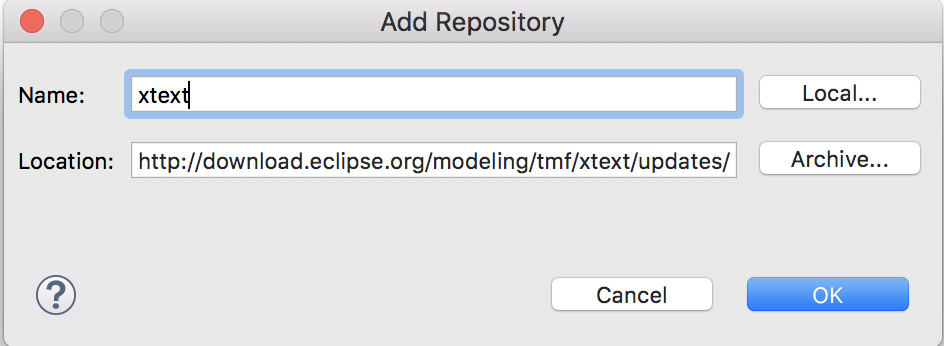

### This is a WIP project that does not have an official release!

# GraphQL-Xtext

[](https://circleci.com/gh/intuit/graphql-xtext/tree/master)

A GraphQL SDL lexer, parser, and validator that generates a traversable Abstract Syntax Tree from your GraphQL schema. GraphQL-Xtext will generate pure Java Objects that can be used at runtime.

The EMF objects can be used to implement Apollo Federation Spec and build a purely java based service that is truly open source.

## Installing the Software 

This project uses `java 8` and `maven 3.3+`. 

1. Download and install [Eclipse 2019](https://www.eclipse.org/downloads/).
2. Install Xtext SDK in Eclipse:  
   a. In Eclipse, click `Help --> Install New Software` 
   
   b. In Available Software, click Add to add a repository with location: 
   
   ```http://download.eclipse.org/modeling/tmf/xtext/updates/composite/releases/```
   
      <br />
   c. Select and install Xtext Complete SDK (2.19.0)  
3. Restart Eclipse.    
   
## Setting up the Project 

1. Clone [graphql-xtext](https://github.intuit.com/data-orchestration/graphql-xtext)
2. Import the cloned project in Eclipse, click `File --> Import Project --> Maven --> Existing Maven Project`
3. Under the directory `com.intuit.graphql`,
right click on `GenerateGraphQL.mwe2 --> Run As --> 1 MWE2 Workflow`

## Testing the grammar in an IDE

Right-click on the `com.intuit.graphql.ide` directory and Run As `Eclipse Application`

## Building the project

```
mvn clean install
```

## Language Server Support

Graphql-Xtext builds a Language Server executable under `com.intuit.graphql.parent/com.intuit.graphql.ide/target/`, named
`com.intuit.graphql.ide-x.y.z-ls.jar`. This can be used to build generic application and cloud-based IDEs for the grammar.

[`theia-xtext`](https://github.com/theia-ide/theia-xtext) is an example of a cloud-based IDE that uses the xtext language server jar.

## License

[Apache 2.0](./LICENSE)

## Contributing
Read the [Contribution guide](./.github/CONTRIBUTING.md)
